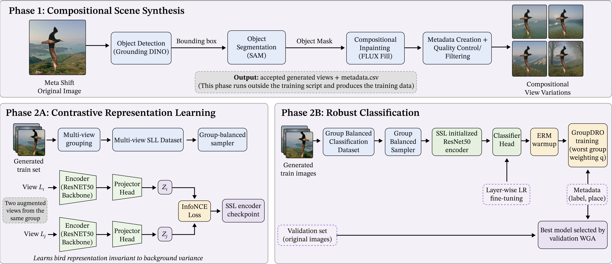

# Breaking Spurious Correlations via Generative Randomization and Cross-Variant Self-Supervised Learning


**Paper:** [Breaking Spurious Correlations via Generative Randomization and Cross-Variant Self-Supervised Learning](paper/Breaking_Spurious_Correlations_via_Generative_Randomization_and_Cross_Variant_Self_Supervised_Learning.pdf)

## Abstract

Deep neural networks trained with Empirical Risk Minimization (ERM) often fail under distribution shifts because they exploit spurious correlations between object labels and background context. Recent generative approaches address this issue by creating counterfactual images with altered contexts, but typically use these samples as standard data augmentation, leaving the model free to retain background-sensitive representations. We propose a two-stage framework that uses generative intervention to explicitly learn background-invariant visual representations. First, we isolate the foreground object using zero-shot segmentation and generate context-shifted variants with a structure-preserving diffusion model, preserving object identity while varying the surrounding environment. We then introduce Cross-Variant Self-Supervised Learning, where variants of the same object under different backgrounds form positive pairs in a contrastive objective. This encourages the encoder to align object-centric representations while suppressing background-specific cues. Then, we fine-tune the pretrained encoder using an ERM warm-up followed by GroupDRO with layer-wise learning rates. Experiments on distribution-shift benchmarks demonstrate best worst-group performance, achieving 92.5% on Waterbirds, 81.7% on MetaShift, and 87.4% on NICO++.


## Pipeline

<p align="center">
  
</p>


## Repository Layout

```text
grssl/
├── data/
│   ├── waterbirds/
│   │   ├── waterbirds_original/
│   │   └── generated/
│   ├── nico++/
│   │   ├── nico_original/
│   │   └── generated/
│   └── metashifts/
│       ├── metashift_original/
│       └── generated/
├── code/
│   ├── waterbirds/
│   │   ├── generate.py
│   │   └── train.py
│   ├── nico++/
│   │   ├── generate.py
│   │   └── train.py
│   └── metashift/
│       ├── generate.py
│       └── train.py
└── plots/
    ├── architecture.pdf
    └── architecture.png
```


## Environment Setup

Create a Python environment with PyTorch, torchvision, transformers, diffusers, Pillow, NumPy, and python-dotenv installed. Example:

```bash
cd /home/suraj/grssl
python -m venv .venv
source .venv/bin/activate
pip install torch torchvision transformers diffusers accelerate pillow numpy python-dotenv
```

The generation scripts use Hugging Face models, including FLUX Fill, Grounding DINO, and SAM. If your model access requires authentication, create a `.env` file in the repository root:

```bash
HF_TOKEN=your_huggingface_token_here
```

## Data Preparation

Expected input folders are:

```text
data/waterbirds/waterbirds_original/
data/nico++/nico_original/
data/metashifts/metashift_original/
```

Generated images and metadata are written to:

```text
data/waterbirds/generated/
data/nico++/generated/
data/metashifts/generated/
```


## Run Image Generation

Run the generation script for each dataset before training if generated images are not already present.

### Waterbirds

```bash
python code/waterbirds/generate.py
```

Input: `data/waterbirds/waterbirds_original/`  
Output: `data/waterbirds/generated/`

### NICO++

```bash
python code/nico++/generate.py
```

Input: `data/nico++/nico_original/`  
Output: `data/nico++/generated/`

### MetaShift

```bash
python code/metashift/generate.py
```

Input: `data/metashifts/metashift_original/`  
Output: `data/metashifts/generated/`


## Run Training

Each training script performs two stages:

1. Self-supervised pretraining with multi-view augmentations.
2. Supervised classifier training with GroupDRO evaluation.

### Waterbirds

```bash
python code/waterbirds/train.py
```

Uses generated train/validation data from `data/waterbirds/generated/` and evaluates on `data/waterbirds/waterbirds_original/test/`.

### NICO++

```bash
python code/nico++/train.py
```

Uses generated training data from `data/nico++/generated/train/` and evaluates on `data/nico++/nico_original/test/`.

### MetaShift

```bash
python code/metashift/train.py
```

Uses generated training data from `data/metashifts/generated/train/` and evaluates on shelf-context cat/dog test folders in `data/metashifts/metashift_original/test/`.

## Outputs

Training artifacts are saved under `output/` by dataset name:

```text
output/waterbirds/
output/nico++/
output/metashift/
```


